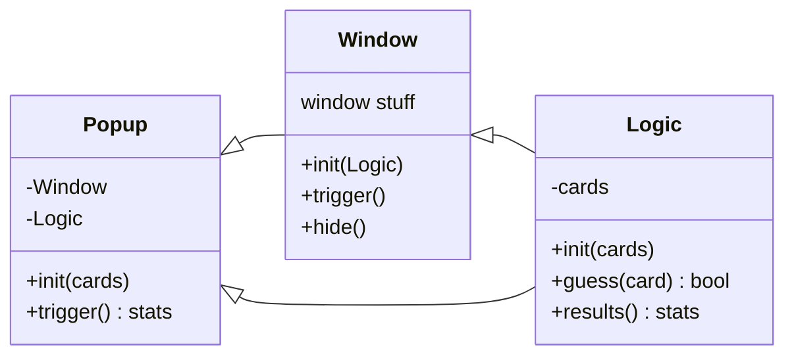
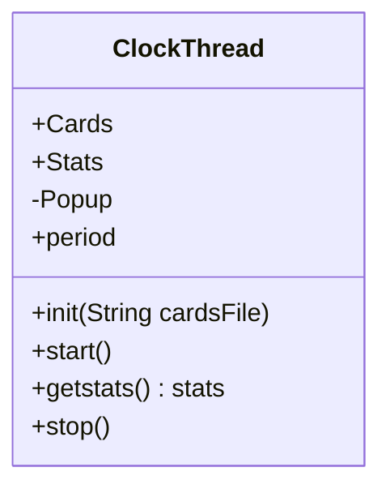
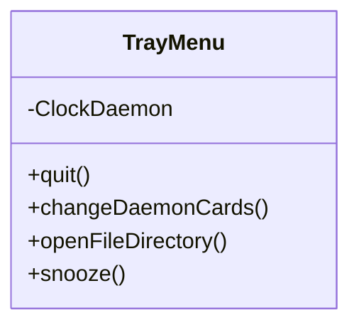
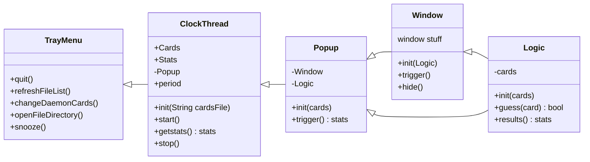

# Class flow and specifications
### Individual subsections
##### Popup

```mermaid
classDiagram
direction LR
    class Logic{
        -cards
        +init(cards)
        +guess(card) bool
        +results() stats
    }
    class Window{
        window stuff
        +init(Logic)
        +trigger()
        +hide()
    }
    class Popup{
        -Window
        -Logic
        +init(cards)
        +trigger() stats
    }

    Popup <|-- Window
    Window <|-- Logic
    Popup <|-- Logic
```
##### Clock thread

```mermaid
classDiagram
direction LR
    class ClockThread{
        +Cards
        +Stats
        -Popup
        +period
        +init(String cardsFile)
        +start()
        +getstats() stats
        +stop()
    }
```

##### Desktop app

```mermaid
classDiagram
direction LR
    class TrayMenu{
        -ClockDaemon
        +quit()
        +changeDaemonCards()
        +openFileDirectory()
        +snooze()
    }
```

### Full diagram

```mermaid
classDiagram
direction LR
    class Logic{
        -cards
        +init(cards)
        +guess(card) bool
        +results() stats
    }
    class Window{
        window stuff
        +init(Logic)
        +trigger()
        +hide()
    }
    class Popup{
        -Window
        -Logic
        +init(cards)
        +trigger() stats
    }

    class ClockThread{
        +Cards
        +Stats
        -Popup
        +period
        +init(String cardsFile)
        +start()
        +getstats() stats
        +stop()
    }

    class TrayMenu{
        +quit()
        +refreshFileList()
        +changeDaemonCards()
        +openFileDirectory()
        +snooze()
    }

    Popup <|-- Window
    Window <|-- Logic
    Popup <|-- Logic

    ClockThread<|-- Popup
    TrayMenu <|-- ClockThread
```
