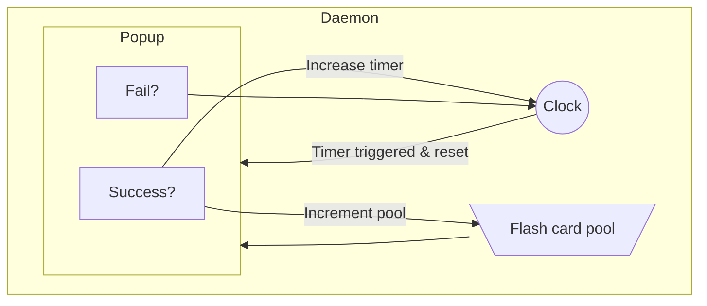

# Design document
## Goal
Nag the user into actually doing their flash card studies. There is no escape; even your gaming shall be interrupted, fool.

## Program Flow

After opening the startup script (either by user or by os boot task), a desktop app is opened, minimized to system tray, and a clock daemon is started as a subthread of the app. When the clock daemon triggers, it opens up a popup window that the user must interract with to close.

##### Desktop App
The desktop app is used to interact with the clock daemon in a user-friendly way. Some of the interractions it can perform are:
    -Stop the whole program
    -Refresh the flash card pack list
    -Update the daemon with a new flash card pack file
    -Open file directory to configuration files
    -Snooze the daemon for a period of time

##### Clock Daemon

The clock daemon is a subthread that opens a popup whenever an internal timer triggers. The timer is set by either the desktop app or by previous user score on the popup (setting changed by desktop app). It can also be reloaded with a different flash card pack file to send to the popup.

##### Popup

The popup is a window that is opened by the clock daemon. Upon being opened, it will choose (randomly or from an incremental pool as the user learns, setting changed by desktop app) from the loaded flash card pack file. Then, it will quiz the user on a sequence of those, requiring the user to properly match each answer. Answering all questions will close the popup and start the clock daemon timer. Successfully answering will increase the timer, as well as increase the pool of possible cards (depending on setting). Failure incurrs no penalties and merely starts the clock daemon once more. Clock is reset to the default time every round of questions.
