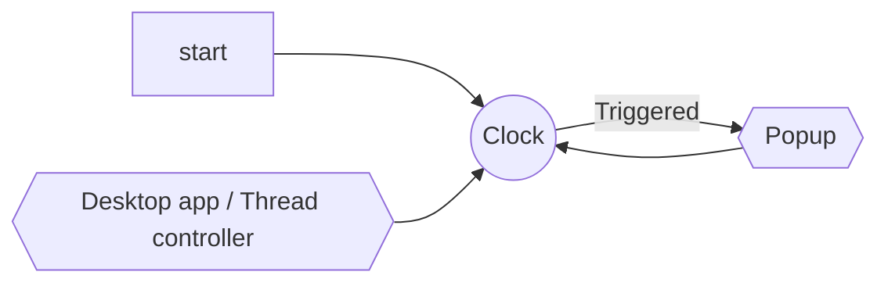
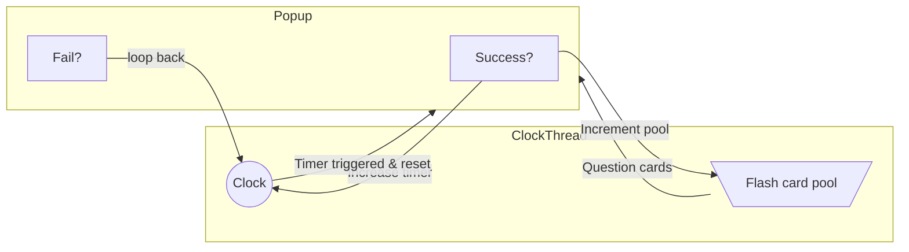

# Design document
## Goal
Nag the user into actually doing their flash card studies. There is no escape; even your gaming shall be interrupted, fool.

## Program Flow

After opening the startup script (either by user or by os boot task), a desktop app is opened, minimized to system tray, and a clock thread is started as a subthread of the app. When the clock thread triggers, it opens up a popup window that the user must interract with to close.

##### Desktop App
The desktop app is used to interact with the clock thread in a user-friendly way. Some of the interractions it can perform are:
- Stop the whole program
- Update the thread with a new flash card pack file
- Open file directory to configuration files
- Snooze the thread for a period of time

##### Clock Thread

The clock thread is a subthread that opens a popup whenever an internal timer triggers. The timer is set by either the desktop app or by previous user score on the popup (setting changed by desktop app). It can also be reloaded with a different flash card pack file to send to the popup.

##### Popup

The popup is a window that is opened by the clock thread. Upon being triggered, it will choose (randomly from everything or from an incremental pool as the user learns, setting changed by desktop app) from the loaded flash card pack file. Then, it will quiz the user on a sequence of those, requiring the user to properly match each answer. Answering all questions will close the popup and start the clock thread timer. Successfully answering will increase the timer until the next popup, as well as increase the pool of possible cards (depending on setting). Failure incurrs no penalties and merely starts the clock thread once more. Clock is reset to the default time every round of questions.
If no input is given for 5 minutes, then the popup assumes a fail state.
Closing the popup window acts as a snooze for 5 minutes.
